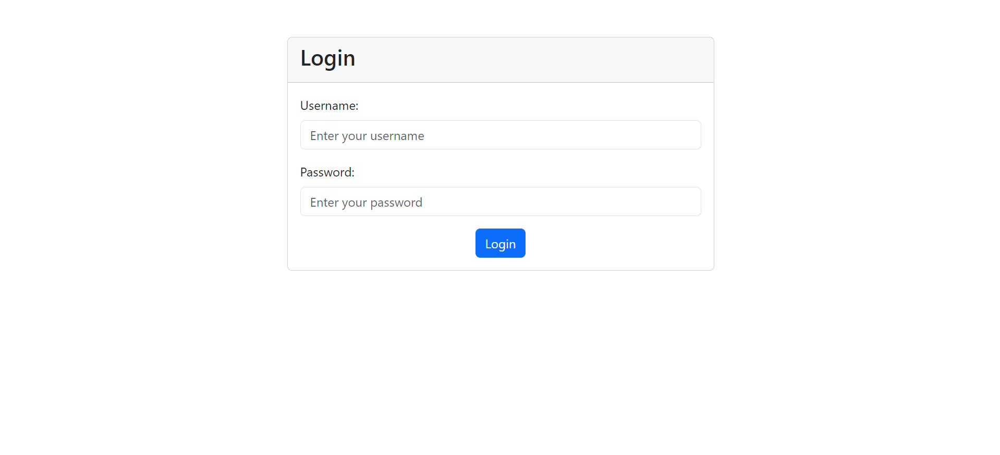
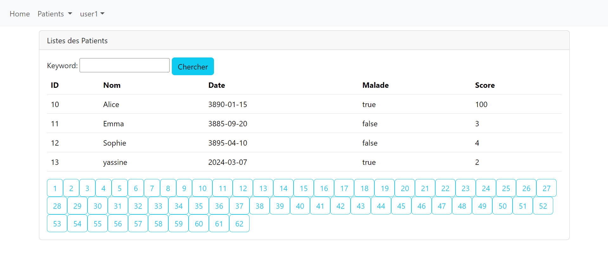
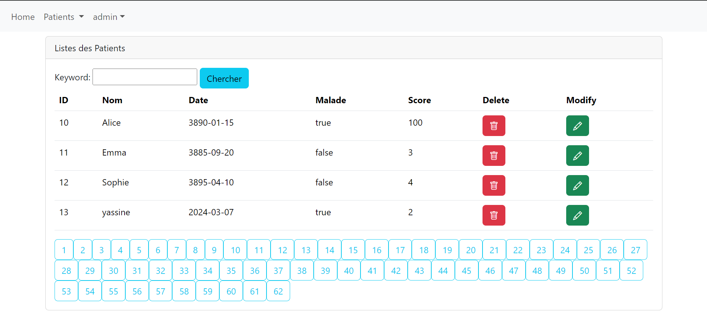
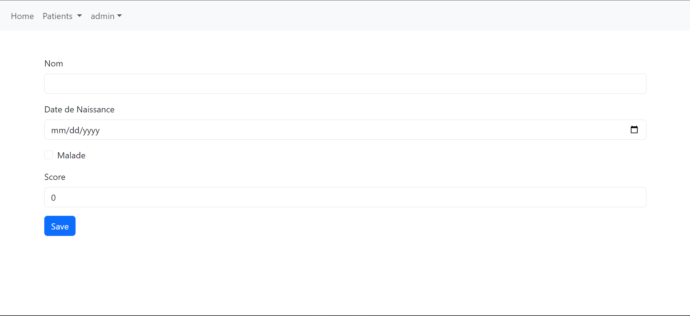
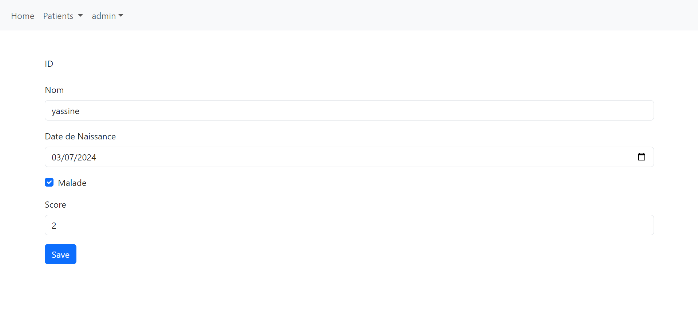

<h1>Compte rendu de l'application de gestion des patients</h1>

<h2>Introduction</h2>

Ce code présente une application de gestion des patients dans un hôpital, développée en utilisant Java EE
avec Spring Boot. L'application comporte plusieurs fonctionnalités, notamment l'ajout, la modification, la suppression
et la recherche de patients. De plus, elle implémente des fonctionnalités de sécurité avec Spring Security pour
restreindre l'accès à certaines parties de l'application.

<h2>Résumé</h2>
    

        L'application est structurée en plusieurs packages, notamment <code>entities</code>, <code>repository</code>, <code>service</code>, <code>web</code>, et <code>security</code>, chacun contenant des classes définissant les entités, les services, les contrôleurs, les repositories et la configuration de sécurité de l'application.
    

<h3>Entities</h3>
    

        La classe <code>Patient</code> définit les caractéristiques d'un patient, telles que son nom, sa date de naissance, son état de maladie et son score.
    

<pre><code>package ma.enset.hospital_jee.entities;

import jakarta.persistence.*;
import jakarta.validation.constraints.NotEmpty;
import jakarta.validation.constraints.Size;
import lombok.AllArgsConstructor;
import lombok.Data;
import lombok.NoArgsConstructor;
import org.springframework.format.annotation.DateTimeFormat;
import java.util.Date;
@Entity
@Data @AllArgsConstructor @NoArgsConstructor
public class Patient {
@Id
@GeneratedValue(strategy = GenerationType.IDENTITY)
private Long id;
@NotEmpty
@Size(min = 4, max = 40)
private String nom;
@Temporal(TemporalType.DATE)
@DateTimeFormat(pattern = "yyyy-mm-dd")
private Date dateNaissance;
private boolean malade;
private int score;
}
</code></pre>
<h3>Repository</h3>
    

        La classe <code>PatientRepository</code> étend JpaRepository pour la gestion des opérations CRUD sur les patients.
    

    <pre><code>package ma.enset.hospital_jee.repository;
import ma.enset.hospital_jee.entities.Patient;
import org.springframework.data.domain.Page;
import org.springframework.data.domain.Pageable;
import org.springframework.data.jpa.repository.JpaRepository;

public interface PatientRepository extends JpaRepository&lt;Patient, Long&gt; {
Page&lt;Patient&gt; findByNomContains(String keyword, Pageable pageable);
}
</code></pre>
    <h3>Service</h3>
    

        L'interface <code>IHospital</code> et son implémentation <code>IHospitalImpl</code> définissent les services liés aux patients, tels que l'ajout d'un patient.
    

    <pre><code>package ma.enset.hospital_jee.service;
import ma.enset.hospital_jee.entities.Patient;

public interface IHospital {
Patient savePatient(Patient obj);
}
</code></pre>
<pre><code>package ma.enset.hospital_jee.service;

import jakarta.transaction.Transactional;
import ma.enset.hospital_jee.entities.Patient;
import ma.enset.hospital_jee.repository.PatientRepository;
import org.springframework.data.domain.Page;
import org.springframework.data.domain.PageRequest;
import org.springframework.stereotype.Service;

@Service
@Transactional
public class IHospitalImpl implements IHospital{
private PatientRepository patientRepository;

    public IHospitalImpl(PatientRepository patientRepository) {
        this.patientRepository = patientRepository;
    }

    @Override
    public Patient savePatient(Patient obj) {
        return patientRepository.save(obj);
    }
}
</code></pre>
<h3>Web</h3>
    

        Le contrôleur <code>PatientController</code> gère les requêtes liées aux patients, telles que l'affichage de la liste des patients, l'ajout, la modification et la suppression d'un patient.
    

    <pre><code>package ma.enset.hospital_jee.web;
import lombok.AllArgsConstructor;
import ma.enset.hospital_jee.entities.Patient;
import ma.enset.hospital_jee.repository.PatientRepository;
import org.springframework.data.domain.Page;
import org.springframework.data.domain.PageRequest;
import org.springframework.stereotype.Controller;
import org.springframework.ui.Model;
import org.springframework.validation.BindingResult;
import org.springframework.web.bind.annotation.*;

import javax.validation.Valid;
import java.util.List;

@Controller
@AllArgsConstructor
public class PatientController {
private PatientRepository patientRepository;
    @GetMapping(path = "/user/index")
    public String patients(Model model,
                           @RequestParam(name = "page", defaultValue = "0") int page,
                           @RequestParam(name = "size", defaultValue = "4") int size,
                           @RequestParam(name = "keyword", defaultValue = "") String kw) {
        Page&lt;Patient&gt; pagePatients = patientRepository.findByNomContains(kw, PageRequest.of(page, size));
        model.addAttribute("listPatients", pagePatients.getContent());
        model.addAttribute("pages", new int[pagePatients.getTotalPages()]);
        model.addAttribute("currentPage", page);
        model.addAttribute("keyword", kw);
        System.out.println(pagePatients.getContent());
        return "patients";
    }
    @GetMapping("/admin/delete")
    public String delete(Long id, String keyword, int page) {
        patientRepository.deleteById(id);
        return "redirect:/user/index?page=" + page + "&keyword=" + keyword;
    }
    @GetMapping("/")
    public String home() {
        return "redirect:/user/index";
    }
    @GetMapping("/patients")
    @ResponseBody
    public List&lt;Patient&gt; lPatients(){
        return patientRepository.findAll();
    }
    @GetMapping("/admin/formPatient")
    public String formPatient(Model model){
        model.addAttribute("patient", new Patient());
        return "formPatient";
    }
    @PostMapping(path = "/admin/save")
    public String save(Model model, @Valid Patient patient,
                       BindingResult bindingResult,
                       @RequestParam(defaultValue = "0") int page,
                       @RequestParam(defaultValue = "") String keyword){
        if (bindingResult.hasErrors()) {
            return "formPatient";
        }
        patientRepository.save(patient);
        return "redirect:/user/index?page="+page+"&keyword="+keyword;
    }
    @GetMapping(path = "/admin/editPatient")
    public String editPatient(Model model, Long id, String keyword, int page) {
        Patient patient = patientRepository.findById(id).orElse(null);
        if (patient == null) {
            throw new RuntimeException("Patient not found");
        }
        model.addAttribute("patient", patient);
        model.addAttribute("keyword", keyword);
        model.addAttribute("page", page);
        return "editPatient";
    }

}
</code></pre>
    <h3>Security</h3>
    

        La classe <code>SecurityConfig</code> configure la sécurité de l'application en définissant les utilisateurs, les rôles et les autorisations, tandis que le contrôleur <code>SecurityController</code> gère les pages d'erreur d'autorisation.
    

    <pre><code>package ma.enset.hospital_jee.security;

import org.springframework.beans.factory.annotation.Autowired;
import org.springframework.context.annotation.Bean;
import org.springframework.context.annotation.Configuration;
import org.springframework.security.config.annotation.web.builders.HttpSecurity;
import org.springframework.security.config.annotation.web.configuration.EnableWebSecurity;
import org.springframework.security.core.userdetails.User;
import org.springframework.security.crypto.password.PasswordEncoder;
import org.springframework.security.provisioning.InMemoryUserDetailsManager;
import org.springframework.security.web.SecurityFilterChain;

@Configuration
@EnableWebSecurity
public class SecurityConfig {
    @Autowired
    private PasswordEncoder passwordEncoder;
    @Bean
    public InMemoryUserDetailsManager inMemoryUserDetailsManager(){
        return new InMemoryUserDetailsManager(
                User.withUsername("user1").password(passwordEncoder.encode("1234")).roles("USER").build(),
                User.withUsername("user2").password(passwordEncoder.encode("1234")).roles("USER").build(),
                User.withUsername("admin").password(passwordEncoder.encode("1234")).roles("ADMIN","USER").build()
        );
    }
    @Bean
    public SecurityFilterChain securityFilterChain(HttpSecurity httpSecurity) throws Exception {
        httpSecurity.formLogin();
        httpSecurity.authorizeHttpRequests().requestMatchers("/user/**").hasRole("USER");
        httpSecurity.authorizeHttpRequests().requestMatchers("/admin/**").hasRole("ADMIN");
        httpSecurity.exceptionHandling().accessDeniedPage("/notAuthorized");
        httpSecurity.authorizeHttpRequests().anyRequest().authenticated();
        return httpSecurity.build();
    }

}
</code></pre>
<pre><code>package ma.enset.hospital_jee.security;

import org.springframework.stereotype.Controller;
import org.springframework.web.bind.annotation.GetMapping;

@Controller
public class SecurityController {
@GetMapping("/notAuthorized")
public String notAuthorized(){
return "notAuthorized";
}
}
</code></pre>
<h2>Quelques captures d'écrans</h2>
<h3>Login page</h3>

<h3>User page</h3>

<h3>Admin Page</h3>

<h3>Ajouter un patient par Admin</h3>

<h3>Modifier un Patient par Admin</h3>

<h2>Conclusion</h2>
    

        En conclusion, ce code présente une application de gestion des patients dans un environnement hospitalier, offrant des fonctionnalités complètes pour gérer les informations des patients de manière efficace et sécurisée. Avec une architecture bien organisée et des fonctionnalités de sécurité robustes, l'application fournit une solution fiable pour les besoins de gestion des patients.
    
